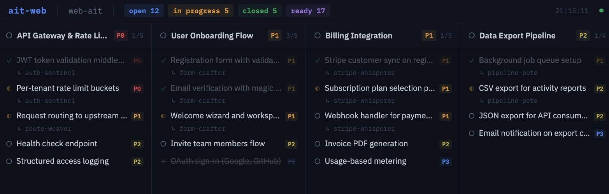

# web-ait

A web dashboard for [ait](https://github.com/ohnotnow/ait) (Agent Issue Tracker). It polls your local ait database and streams updates to the browser via Server-Sent Events so you can see what your coding agents are up to.



## What it does

- Displays epics as columns with their child tasks listed vertically
- Shows status icons, priority badges, and which agent has claimed each task
- Completed epics collapse to narrow strips and slide to the right, keeping active work front and centre
- When everything is done, a calm "all clear" state replaces the board
- Auto light/dark mode based on your system preference
- Auto-reconnects if the SSE connection drops

## Prerequisites

- [Bun](https://bun.sh/) (v1.0+)
- [ait](https://github.com/ohnotnow/agent-issue-tracker) installed and available on your PATH

## Quick start

```bash
bun install
bun run dev
```

This starts the server with hot-reload on `http://localhost:6174` (or the next free port).

## Usage

Point it at any directory containing an `.ait/ait.db` database:

```bash
bun run server.ts /path/to/your/project
```

### Options

| Flag | Default | Description |
|------|---------|-------------|
| `--port <n>` | `6174` | Preferred port (auto-finds a free one if not specified) |
| `--poll <n>` | `3` | Poll interval in seconds |
| `--ait-path <path>` | `ait` | Path to the ait binary |
| `--localhost` | off | Bind to 127.0.0.1 only (default is 0.0.0.0 for LAN access) |

### Shell alias

If you'd like a quick `webait` command that launches the dashboard for whatever directory you're in:

```bash
# Add to your ~/.bashrc or ~/.zshrc
alias webait='bun run /path/to/web-ait/server.ts "$(pwd)"'
```

Then just `cd` into any project with an `.ait` database and run `webait`.

## Licence

[MIT](LICENSE)
